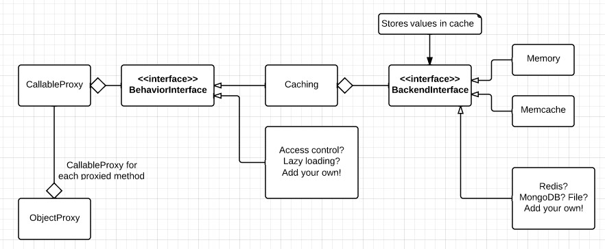

# PHP proxy

This library provides proxy classes with easily extendable behavior. Caching proxy included!

# Requirements and dependencies

This library has no external dependencies, if installed with `--no-dev` option. Caching behavior memcache backend requires php `memcache` module to be enabled.

# Installation

    php composer.phar require mz/php-proxy

# Basic usage

#### In-memory cache proxy

```php
use MZ\Proxy\Shortcuts;

// object proxy
$object = new MyComplexClass();
$proxy = Shortcuts\wrapWithMemoryProxy($object, 5); // 5 seconds timeout (default = 0 - infinite)
$proxy->foo();  // executes foo, stores result in cache
$proxy->foo();  // returns cached result, real foo method is not executed
$proxy->bar();  // works here too
$property = $proxy->my_property  // exactly as $object->my_property
$proxy->my_property = 123; // exactly as $object->my_property = 123

// set cached methods
$proxy->proxySetMethods(array('foo', 'bar'));
$proxy->foo();  // cached
$proxy->bar();  // cached
$proxy->baz();  // not cached

$proxy->proxySetMethods(null); // all methods cached fro this point (default)

$callable = function() {
    // some time intensive code...
};
$proxy = Shortcuts\wrapWithMemoryProxy($callable);
$result = $proxy();  // executes function
$result = $proxy();  // returns cached result
```

#### Cache proxy with memcache
```php
use MZ\Proxy\Shortcuts;

$object = new MyComplexClass();

$memcache = new \Memcache();
$memcache->addServer('localhost', 11211);

$proxy = Shortcuts\wrapWithMemcacheProxy(
    $object,
    'memcache_prefix',
    $memcache
);

$result = $proxy->foo();  // executes foo
$result = $proxy->foo();  // returns cached result, real foo method is not executed
```

# Concepts



# Extending proxy behavior

TODO

# Limitations

Proxies do not implement subjects interface.

# Examples

TODO